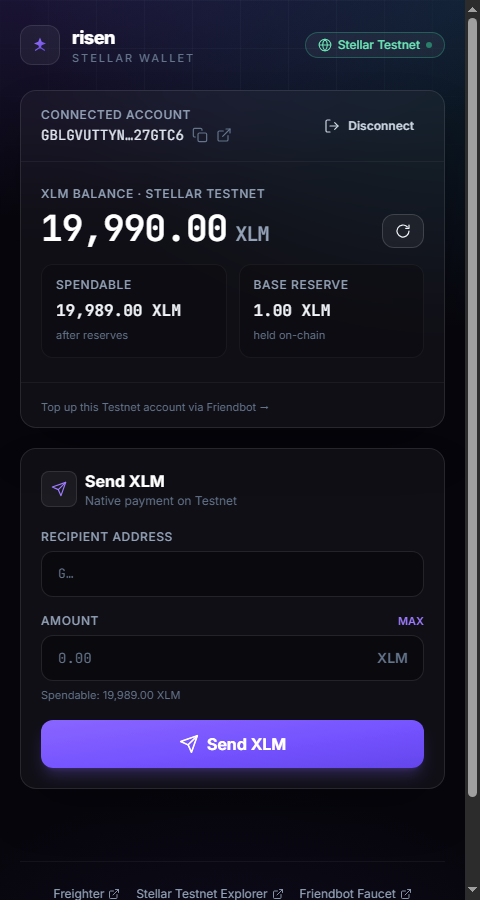
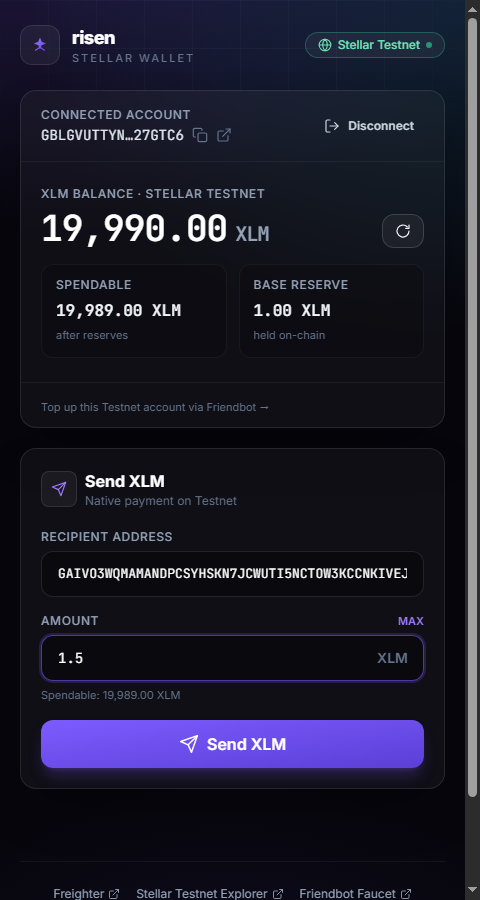
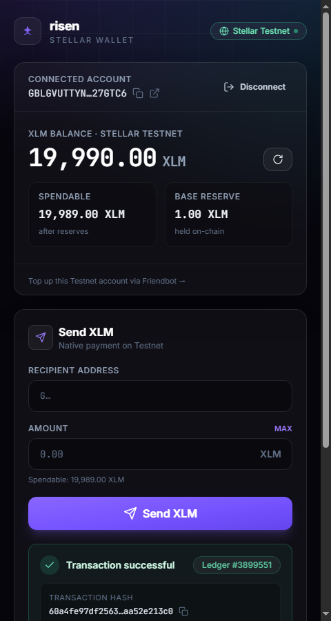

<div align="center">

# ✦ risen

**A production-ready Stellar Testnet dApp — connect your Freighter wallet, view your live XLM balance, and broadcast real native payments.**


</div>

---

**risen** is a clean, fast, fully on-chain Stellar dApp built for the *Stellar Frontend Challenge — Level 1*. It connects to the [Freighter](https://www.freighter.app/) browser wallet, reads a live XLM balance straight from Horizon, and lets you send native XLM payments on **Testnet** — returning a real transaction hash with a one-click link to the on-chain explorer. Everything targets Testnet, so no real funds are ever involved.

> ⚡ **No Freighter installed?** risen ships with a built-in **Demo Mode** (an in-browser mock wallet backed by a *real* Friendbot-funded Testnet account) so you can preview the entire UI — connect, balance, send, and a genuine on-chain transaction — without ever installing the extension.

---

## ✨ Features

- 🔐 **Wallet connect** — one-click Freighter connection with access prompts handled gracefully
- 🔓 **Wallet disconnect** — clean teardown that clears the shared session
- 💰 **Live XLM balance** — real-time balance + spendable amount (accounting for the Stellar base reserve) read from Horizon
- 🚀 **Send XLM on Testnet** — native payment flow with client-side validation (valid address, sufficient funds, spendable guard)
- 🔗 **Transaction feedback** — success result with the on-chain **tx hash**, ledger number, and a deep link to [stellar.expert](https://stellar.expert/explorer/testnet)
- 🛡️ **Network detection & Testnet guard** — detects the selected Freighter network and blocks actions if the wallet isn't on Testnet
- 🧪 **Demo / mock mode** — runs the full flow without Freighter, using a real Testnet keypair funded by Friendbot
- 🎨 **Polished UI** — responsive, dark, glassy design built with TailwindCSS, with toast notifications and smooth transitions

---

## 🧱 Tech Stack

| Layer | Tech |
| --- | --- |
| Framework | [React 18](https://react.dev/) |
| Build tool | [Vite 5](https://vitejs.dev/) |
| Language | [TypeScript 5](https://www.typescriptlang.org/) |
| Styling | [TailwindCSS 3](https://tailwindcss.com/) |
| Wallet | [@stellar/freighter-api 6](https://www.npmjs.com/package/@stellar/freighter-api) |
| Chain | [@stellar/stellar-sdk 16](https://www.npmjs.com/package/@stellar/stellar-sdk) |
| Deploy | [Vercel](https://vercel.com/) (static SPA) |

---

## 🚀 Getting Started

### Prerequisites

- [Node.js](https://nodejs.org/) **18+** (tested on Node 22)
- npm (ships with Node)

### Setup

```bash
# 1. Clone the repository
git clone <your-repo-url>
cd risen

# 2. Install dependencies
npm install

# 3. Start the dev server
npm run dev
```

Then open **[http://localhost:5173](http://localhost:5173)** in your browser. 🎉

### Production build

```bash
npm run build      # type-checks (tsc) + bundles into dist/
npm run preview    # preview the production build locally
```

---

## 🦊 Freighter Setup (real wallet)

1. **Install** the [Freighter](https://www.freighter.app/) browser extension.
2. **Create / import** a wallet inside Freighter.
3. Switch the Freighter network to **Test Net** (bottom-left of the extension popup).
4. **Fund** your account for free via Friendbot — open:
   ```
   https://friendbot.stellar.org/?addr=YOUR_STELLAR_ADDRESS
   ```
   (replace `YOUR_STELLAR_ADDRESS` with your Freighter public key, starting with `G…`)
5. Reload risen, click **Connect Wallet**, and you're ready to send XLM.

---

## 🧪 Demo Mode (no Freighter required)

risen can run entirely **without** the Freighter extension. Demo Mode swaps in an in-browser mock wallet that is backed by a **real Testnet keypair** auto-funded by Friendbot — so balances and the transaction you send are genuine on-chain Testnet activity, not fake data.

To enable it, create a local env file:

```bash
# .env.local  (git-ignored)
VITE_MOCK_WALLET=true
```

Then run `npm run dev` as usual. The mock keypair is stored in `localStorage` and is a throwaway Testnet account — **never reuse its secret on Mainnet**.

---

## 🖼️ Screenshots

A walkthrough of the full flow (captured in Demo Mode with real Testnet transactions):

| # | State | Screenshot |
| --- | --- | --- |
| 1 | Wallet connected (address shown truncated) |  |
| 2 | Live XLM balance displayed |  |
| 3 | Send form / payment flow |  |
| 4 | Transaction result — hash + explorer link |  |

---

## ☁️ Deploy to Vercel

risen is a static SPA — deploy in seconds:

1. Push the repo to GitHub.
2. In [Vercel](https://vercel.com/new), **Import** the repository.
3. Vercel auto-detects Vite. Confirm:
   - **Build Command:** `npm run build`
   - **Output Directory:** `dist`
4. Click **Deploy**. (The included `vercel.json` adds SPA rewrites + asset caching.)

> Leave `VITE_MOCK_WALLET` **unset** in production to use the real Freighter extension.

---

## 🗂️ Project Structure

```
risen/
├── src/
│   ├── components/      # UI (Header, Footer, WalletPanel, BalanceCard, SendForm, Toast, NetworkBanner, ui)
│   ├── hooks/           # useStellarWallet — wallet/balance/payment state machine
│   ├── lib/             # stellar.ts, freighter.ts, wallet.ts, mockWallet.ts, format.ts
│   ├── App.tsx          # app shell + layout
│   ├── config.ts        # network/explorer constants
│   ├── types.ts         # shared domain types
│   └── index.css        # Tailwind layers + theme tokens
├── index.html
├── tailwind.config.js
├── vite.config.ts
└── vercel.json
```

---

## 📝 Notes on the Freighter API

This project targets `@stellar/freighter-api` **v6**, which renamed several methods from earlier versions:

| Classic (v1–v5) | Current (v6) |
| --- | --- |
| `requestConnection()` | `requestAccess()` |
| `getPublicKey()` | `getAddress()` |
| `getNetwork()` | returns `{ network, networkPassphrase }` (no `result` wrapper) |

Installation detection pings Freighter's content-script message protocol with a short timeout, since the extension exposes no stable global and several SDK calls hang forever when the extension is absent.

---

## 📄 License

[MIT](./LICENSE) © 2026 risen
